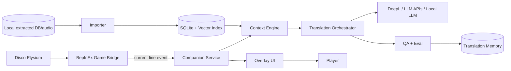

# Architecture

## Event flow

1. Game bridge emits `DialogueLineSeen`.
2. Companion service debounces and deduplicates.
3. Context engine builds a context packet:
   - line,
   - speaker,
   - skill voice,
   - conversation,
   - location,
   - previous lines,
   - nearby branch nodes,
   - player options,
   - known variables,
   - audio reference,
   - spoiler budget.
4. Translation orchestrator generates:
   - Ukrainian translation,
   - quick note,
   - deep annotation,
   - idiom/culture notes,
   - quality score.
5. Overlay renders compact card.
6. Player can click words/phrases for deeper explanation.
7. Accepted/fixed translations update memory.

## Storage

- `context.sqlite`: local generated context index.
- `translation_memory.sqlite`: local user review memory.
- `glossary.sqlite`: curated terms and style choices.
- `eval_runs/`: generated eval output, ignored by git.

## Spoiler policy

Default context retrieval should prefer:
- current node,
- previous player-visible nodes,
- sibling response options,
- non-spoiler metadata,
- glossary.

Deep future branches and hidden consequences require explicit "allow spoilers" mode.
